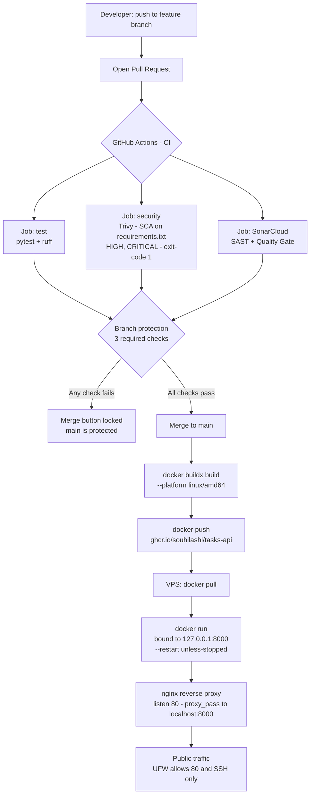

# Tasks API

A simple REST API for managing tasks, built with FastAPI.
This project demonstrates a secure CI/CD pipeline with automated
testing and vulnerability scanning.

**The pipeline is the project** — the application is deliberately simple so the
focus stays on how code is tested, scanned, gated, built and deployed. Every
change reaches production the same way: a branch, a pull request, three required
checks, then a container pulled from a registry and served behind a reverse proxy.

## Features

- Create a task
- Retrieve a task by ID
- Health check endpoint

## Tech stack

- Python 3.12
- FastAPI
- Docker
- pytest for testing
- ruff for linting
- Trivy for vulnerability scanning (SCA)
- SonarCloud for static analysis (SAST)
- GitHub Actions for CI
- nginx as a reverse proxy

## Running locally

    python -m venv .venv
    source .venv/bin/activate
    pip install -r requirements.txt
    uvicorn app.main:app --reload

Then open http://localhost:8000/docs to explore the API.

## Running the tests

    pytest
    ruff check .

## Running with Docker

    docker build -t tasks-api .
    docker run -p 8000:8000 tasks-api

Note: `-p 8000:8000` publishes the container on every network interface, which is
fine on a local machine. In production the container is bound to `127.0.0.1:8000`
and only nginx is exposed — see [Deployment](#deployment).

---

## Architecture



---

## The workflow: branch, pull request, gate

Nothing is ever committed directly to `main`.

1. Create a branch for the change.
2. Open a pull request.
3. CI runs automatically on the pull request.
4. The merge is blocked until every required check is green.
5. Merge to `main`.

`main` is protected by a ruleset (`protect main`) with three **required status checks**:

| Check | What it does |
|---|---|
| `CI / test` | pytest test suite and the ruff linter |
| `CI / security` | Trivy dependency scan |
| `SonarCloud Code Analysis` | static analysis and the Quality Gate |

Required checks are what turn advice into a rule. Without them the scans still run, but a developer can ignore a red result and merge anyway. With them, the merge button is physically unavailable until the problem is fixed.

---

## The security pipeline

### Two jobs, in parallel

The CI workflow runs `test` and `security` as two separate jobs rather than steps in one job. They are independent, so they run at the same time — faster feedback, and a failure in one is reported distinctly from the other.

### SCA — Trivy

Trivy scans `requirements.txt` against a database of known vulnerabilities (CVEs) in third-party packages. This is **Software Composition Analysis**: checking the code you *depend on*, not the code you wrote.

Configured to fail the job (`exit-code: 1`) on `HIGH` and `CRITICAL` findings. Lower severities are visible in the log but do not block — a gate that blocks on everything gets switched off within a week.

### SAST — SonarCloud

SonarCloud analyses the source code itself for bugs, code smells and security issues. This is **Static Application Security Testing**: the code you *wrote*.

It runs as a GitHub App watching the repository from outside, not as a step inside `ci.yml`. It reports back as its own required check.

The project follows the **clean as you code** principle: the historic baseline is acknowledged, and the gate enforces quality on *new* code so the codebase improves with every change instead of stalling behind a large backlog.

### Supply-chain safety: pinning actions to commit SHAs

Every GitHub Action in the workflow is pinned to a **full commit SHA**, not a moving tag.

```yaml
# Not this — a tag can be silently repointed by its owner
- uses: actions/checkout@v4

# This — a commit hash is immutable
- uses: actions/checkout@<full-40-character-sha>  # v4.x.x
```

A tag like `v4` is a *label*. Whoever owns the action can move that label to different code at any time, and your pipeline would pull it without you noticing — a real supply-chain attack path. A commit SHA can never change under you. The version is kept in a trailing comment so the pin is still readable by a human.

### The pipeline never fixes code automatically

Scanners report and block. They do not rewrite source. A pipeline that silently "fixes" code hides the problem from the person who needs to understand it.

---

## Proof: the gate blocking a real vulnerability

The pipeline was verified deliberately rather than assumed to work.

A known-vulnerable dependency was introduced on a branch: `requests==2.19.1`, affected by **CVE-2018-18074** (HIGH).

- The `CI / security` check failed.
- The merge button on the pull request was greyed out.
- Nothing could reach `main`.

The dependency was then bumped to a patched version, all three checks turned green, and the pull request was merged honestly.

> _[Attach screenshot: security-gate-blocks-merge.png]_

This is the single most important artefact in the project: evidence that the gate stops a genuine vulnerability, not just a synthetic one.

---

## Deployment

### Build once, push, pull

The image is built on the development machine and pushed to **GitHub Container Registry (GHCR)**. The server only ever pulls a finished, versioned image.

The server never sees the source code — a smaller attack surface and a cleaner separation between building and running.

```bash
docker buildx build --platform linux/amd64 -t ghcr.io/souhilashl/tasks-api:latest .
docker push ghcr.io/souhilashl/tasks-api:latest
```

**Architecture note:** the build machine is Apple Silicon (arm64); the VPS is Intel/AMD (amd64). Docker guarantees portability across machines of the *same* architecture, not across different ones — the first pull failed with `no matching manifest for linux/amd64`. The fix is an explicit `--platform` build. Only the target architecture is built, to keep build time and storage down.

**Registry auth** uses a classic personal access token scoped to `write:packages` only, piped through `--password-stdin` so it never lands in shell history. Least privilege, and no secret on disk in plain text.

### Run

```bash
docker pull ghcr.io/souhilashl/tasks-api:latest
docker run -d --restart unless-stopped -p 127.0.0.1:8000:8000 ghcr.io/souhilashl/tasks-api:latest
```

The port binding is deliberate. `-p 8000:8000` would publish the container on every interface — and because **Docker writes its own iptables rules, it bypasses UFW entirely**, so the firewall would not save you. Binding to `127.0.0.1:8000` makes the app reachable only from the host itself. The outside world never touches port 8000.

### Firewall

UFW is default-deny, allow-by-exception:

```bash
sudo ufw allow OpenSSH        # allowed BEFORE enabling, or you lock yourself out
sudo ufw enable
sudo ufw allow "Nginx HTTP"   # port 80
```

### Reverse proxy — nginx

nginx runs on the host and is the only thing listening publicly.

```nginx
server {
    listen 80;
    server_name <vps-ip>;

    location / {
        proxy_pass http://127.0.0.1:8000;
        proxy_set_header Host $host;
        proxy_set_header X-Real-IP $remote_addr;
        proxy_set_header X-Forwarded-For $proxy_add_x_forwarded_for;
        proxy_set_header X-Forwarded-Proto $scheme;
    }
}
```

`proxy_pass` **is** the reverse proxy: it forwards each request to the single app on localhost. (Forwarding to one app — not load balancing, which splits traffic across several copies.) The `proxy_set_header` lines pass the original visitor's details through, so the application is not blind to who is really calling.

Config files live in `sites-available` and are switched on by a symlink in `sites-enabled` — nginx only reads the latter. This gives a clean on/off switch without deleting anything. The default site's symlink is removed so it no longer competes for port 80.

```bash
sudo ln -s /etc/nginx/sites-available/tasks-api /etc/nginx/sites-enabled/
sudo rm /etc/nginx/sites-enabled/default
sudo nginx -t                    # always validate before applying
sudo systemctl reload nginx      # graceful; no dropped connections
```

**Why a reverse proxy and not an API gateway or load balancer:** a reverse proxy is what a single-VPS deployment needs — TLS termination, a standard public port, hiding the app, and room for routing later. An API gateway (auth, rate limiting across many APIs) is overkill for one service; a load balancer is pointless with one server. Both are noted for when the architecture grows.

nginx is installed on the host rather than containerised. For a single service that is simpler and clearer. As the stack grows it belongs in Docker Compose, so the whole environment is code — version-controlled and reproducible.

---

## What I learned

- A security tool that only reports is advice. A **required check** is a rule. The difference is branch protection.
- Gate on what matters (`HIGH`, `CRITICAL`) and report the rest. A gate that blocks on everything gets disabled.
- **Prove the gate works.** Deliberately introducing a real CVE and watching the merge button lock is worth more than any passing badge.
- Pinning to commit SHAs instead of tags closes a real supply-chain path — and it costs nothing.
- Docker's iptables rules bypass UFW. A firewall rule you assumed was protecting you may not be.
- SCA and SAST answer different questions: the code you depend on, and the code you wrote. A serious pipeline needs both.

---

## Roadmap

- [ ] HTTPS via Let's Encrypt once a domain name is attached
- [ ] Tag images by commit SHA instead of `latest` once deployment is automated in CI
- [ ] Extend Trivy to scan the built image, not only `requirements.txt`
- [ ] Multi-stage Dockerfile with a non-root user and a minimal base image
- [ ] Containerise nginx in Docker Compose as the stack grows